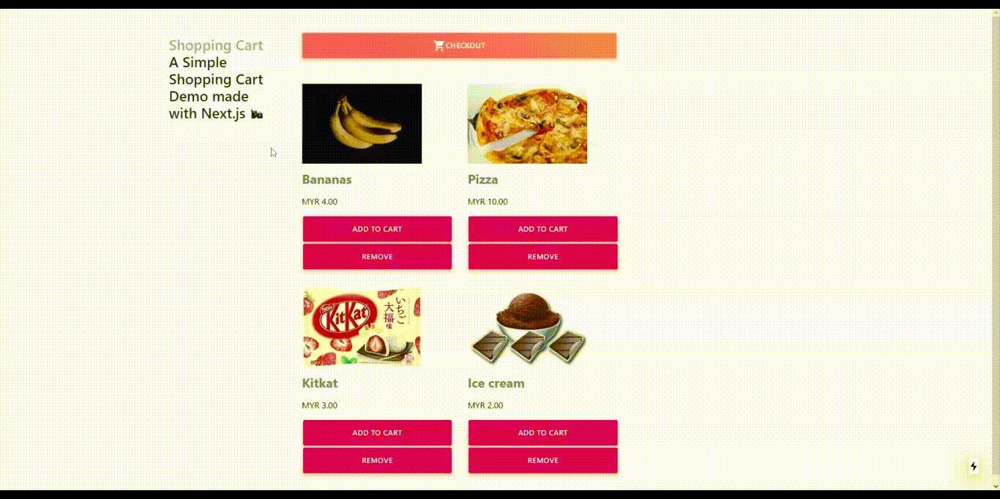

# Example Shopping Cart page with Stripe made with NextJs


## Demo

- Live demo: https://shopping-cart-with-stripe.vercel.app/

The demo is running in test mode -- use `4242424242424242` based on Stripe's test card number with any CVC + future expiration date.

Use the `4000000000003220` test card number to trigger a 3D Secure challenge flow.

Read more about testing on Stripe at https://stripe.com/docs/testing.

<details open><summary>Shopping Cart Checkout Demo</summary>

</details>

### Required configuration

Copy the `.env.local.example` file into a file named `.env.local` in the root directory of this project:

```bash
cp .env.local.example .env.local
```

You will need a Stripe account ([register](https://dashboard.stripe.com/register)) to run this sample. Go to the Stripe [developer dashboard](https://stripe.com/docs/development#api-keys) to find your API keys and replace them in the `.env.local` file.

```bash
NEXT_PUBLIC_STRIPE_PUBLISHABLE_KEY=<replace-with-your-publishable-key>
STRIPE_SECRET_KEY=<replace-with-your-secret-key>
```

Now install the dependencies and start the development server.

```bash
npm install
npm run dev
# or
yarn
yarn dev
```


